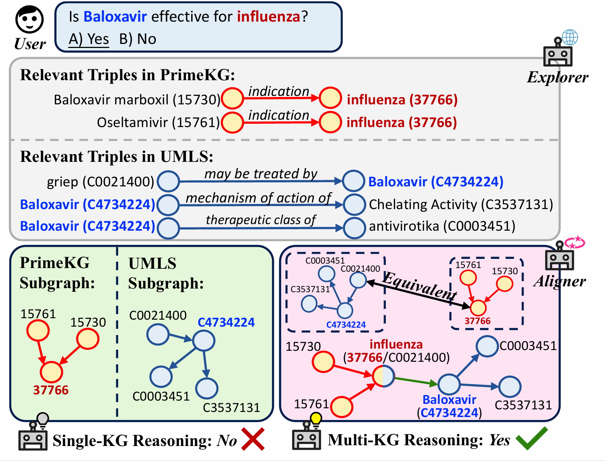

# KGFlow
<p align="center">
  
</p>

KGFlow is a research-oriented framework for multiple-choice medical question answering. It uses large language models (LLMs) to jointly reason over multiple heterogeneous knowledge graphs (KGs) instead of relying on a single KG.

Given a medical question:
- A **Knowledge Explorer** agent retrieves relevant triples in parallel from all connected KGs.
- A **Graph Aligner** semantically aligns and fuses these triples into candidate reasoning chains.
- A **Contextual Pruner** scores and filters the chains, retaining the most informative evidence paths for the final answer.

This multi-agent, multi-KG workflow provides broader evidence coverage and more robust, explainable reasoning than single-KG approaches. Experiments on five multi-choice medical QA benchmarks show that KGFlow consistently outperforms strong baselines and can be easily adapted to new KG combinations and multilingual settings thanks to its plug-and-play design.


# Data
## Knowledge Graphs

KGFlow currently uses [PrimeKG](https://zitniklab.hms.harvard.edu/projects/PrimeKG/), [Hetionet](https://het.io/), [UMLS](https://www.nlm.nih.gov/research/umls/licensedcontent/umlsknowledgesources.html), and the Chinese medical KG [CPubMedKG](https://cpubmed.openi.org.cn/graph/wiki#) as its knowledge bases. You can obtain them from the following links:

- [PrimeKG](https://zitniklab.hms.harvard.edu/projects/PrimeKG/)
- [Hetionet](https://het.io/)
- [UMLS](https://www.nlm.nih.gov/research/umls/licensedcontent/umlsknowledgesources.html)
- [CPubMedKG](https://cpubmed.openi.org.cn/graph/wiki#)

Please refer to each resource's license and access requirements (UMLS and CPubMedKG typically require prior authorization).

## Datasets

We evaluate KGFlow on five multiple-choice medical QA datasets: [MMLU-Med](https://aclanthology.org/2024.findings-acl.372/), [MedQA-US](https://aclanthology.org/2024.findings-acl.372/), [MedMCQA](https://aclanthology.org/2024.findings-acl.372/), [PubMedQA](https://aclanthology.org/D19-1259/), and [BioASQ-Y/N](https://aclanthology.org/2024.findings-acl.372/).

To assess multilingual capability, we additionally use two Chinese medical benchmarks: [CMMLU-Med](https://aclanthology.org/2024.findings-acl.671/) and [CEval-Med](https://arxiv.org/abs/2305.08322).

Preprocessed versions of these datasets (or scripts to prepare them) are provided in the `Dataset` folder of this repository.

# Project Structure

```text
.
├── Dataset/
│   ├── dataset/                # Raw / preprocessed QA data files
│   ├── PubMedQADataset.py      # Dataset wrapper for PubMedQA
│   └── QADataset.py            # Generic multiple-choice QA dataset interface
├── KGs/
│   ├── hetionet.py             # Hetionet KG interface & utilities
│   ├── primeKG.py              # PrimeKG KG interface & utilities
│   └── umls.py                 # UMLS KG interface & utilities
├── environment.yml             # Conda environment specification
├── kg_alignment.py             # Graph Aligner agent: multi-KG triple alignment
├── kg_explore.py               # Knowledge Explorer agent: KG triple retrieval
├── kg_fuser.py                 # Utilities for fusing KG evidence
├── kgflow.py                   # Main KGFlow pipeline
├── local_llm.py                # Local LLM backend configuration
├── promptTemplate.py           # Prompt templates for all LLM agents
└── README.md                   # Project documentation
```

# Usage

To use KGFlow, follow these steps:

## 1. Install the environment

1. Make sure you have [Conda](https://docs.conda.io/) installed.
2. Create the environment from the provided file:

   ```bash
   conda env create -f environment.yml
   ```

3. Activate the environment:

   ```bash
   conda activate kgflow
   ```


## 2. Prepare Neo4j

1. Install Neo4j (https://neo4j.com/) or launch the official Docker image; the Docker flavor usually requires the least manual setup.
2. Load each knowledge graph:
   - **UMLS**: Extract entities from `MRCONSO.RRF` and relations from `MRREL.RRF`; use the Concept Unique Identifier (CUI) as the node key and store all aliases/attributes on the node.
   - **PrimeKG & CPubMedKG**: Use the official Neo4j import tooling(neo4j-admin import) to ingest the provided files.
   - **Hetionet**: Run the Neo4j Docker image that ships with the pre-built Hetionet graph.
3. Request the required licenses before downloading UMLS or CPubMedKG, as both datasets are access controlled.

## 3. Prepare Model

1. Choose one or more LLMs to use. The models we use in our experiments are:

   - Llama 3.1 8B Instruct: <https://huggingface.co/meta-llama/Llama-3.1-8B-Instruct>
   - HuatuoGPT-o1-8B: <https://huggingface.co/FreedomIntelligence/HuatuoGPT-o1-8B>
   - Qwen3-8B: <https://huggingface.co/Qwen/Qwen3-8B>

2. Download the model weights from Hugging Face to a local directory, or let the script automatically download them on the first run (you may need to configure your Hugging Face token or access permissions).

3. Note the local path to the model directory; you will pass it via the `--model` argument when running KGFlow.

## 4. Run the main KGFlow program

1. Make sure:
    - The Conda environment is activated.(conda activate kgflow)
    - All Neo4j instances are running and accessible via bolt://.
    - The model directory path is correct.

2. Run KGFlow with the corresponding connection parameters:

   ```bash
   python kgflow.py \
     --model /path/to/model_dir \
     --umls_url bolt://host:port --umls_username username --umls_password password \
     --primekg_url bolt://host:port --primekg_username username --primekg_password password \
     --hetionet_url bolt://host:port --hetionet_username username --hetionet_password password
   ```


