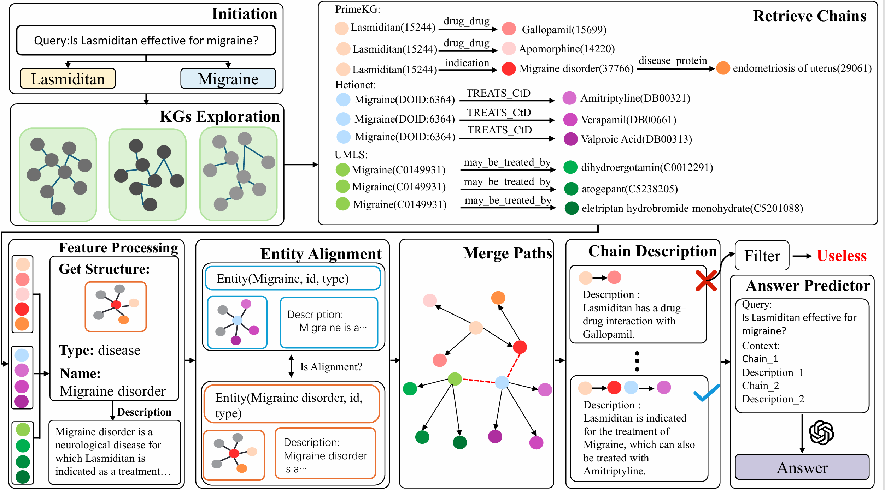

# KGFlow

KGFlow is a research-oriented framework for medical question answering that uses large language models to reason jointly over multiple knowledge graphs (KGs) instead of a single source. Given a medical query, a Knowledge Explorer agent first retrieves relevant knowledge triples in parallel from heterogeneous KGs, a Graph Aligner then semantically integrates these triples into candidate reasoning chains, and a Contextual Pruner finally filters them to retain the most informative paths for inference. This multi-agent, multi-KG workflow enables more comprehensive evidence coverage and more robust, explainable reasoning compared to single-KG approaches. Experiments on five multi-choice medical QA benchmarks show that KGFlow achieves consistent performance gains over state-of-the-art baselines and can be easily adapted to new KG combinations and multilingual settings thanks to its plug-and-play design.


# Data
## Knowledge Graph
KGFlow uses PrimeKG, Hetionet, and UMLS as its knowledge bases.

You can download them from the following links:

PrimeKG: https://zitniklab.hms.harvard.edu/projects/PrimeKG/

Hetionet: https://het.io/

UMLS: https://www.nlm.nih.gov/research/umls/licensedcontent/umlsknowledgesources.html

## Dataset

We used five multiple-choice medical QA datasets to evaluate our proposed model: MMLU-Med, MedQA-US, MedMCQA, PubMedQA, and BioASQ-Y/N.

You can find them in the `Dataset` folder of this repository.

# Project Structure

```text
.
├── Dataset/
│   ├── dataset/                # Raw / preprocessed QA data files
│   ├── PubMedQADataset.py      # Dataset wrapper for PubMedQA
│   └── QADataset.py            # Generic multiple-choice QA dataset interface
├── KGs/
│   ├── hetionet.py             # Hetionet KG interface & utilities
│   ├── primeKG.py              # PrimeKG KG interface & utilities
│   └── umls.py                 # UMLS KG interface & utilities
├── environment.yml             # Conda environment specification
├── kg_alignment.py             # Graph Aligner agent: multi-KG triple alignment
├── kg_explore.py               # Knowledge Explorer agent: KG triple retrieval
├── kg_fuser.py                 # Utilities for fusing KG evidence
├── kgflow.py                   # Main KGFlow pipeline
├── local_llm.py                # Local LLM backend configuration
├── promptTemplate.py           # Prompt templates for all LLM agents
├── KGFlow.png                  # Overview figure of the KGFlow framework
└── README.md                   # Project documentation
```

# Usage

To use KGFlow, follow these steps:

## 1. Install the environment
Bash

```
conda env create -f environment.yml
```


## 2. Prepare Neo4j

You can download and install Neo4j from https://neo4j.com/. The Docker version is recommended.

For UMLS, entities and triples are extracted from the MRCONSO.RRF and MRREL.RRF files, respectively.
The Concept Unique Identifier serves as the unique node identifier, with each node storing all corresponding entity names and relationship attributes defining the connections between them.

PrimeKG and Hetionet are directly imported into a Neo4j database.
## 3. Prepare Model

The LLM can be downloaded from https://huggingface.co/, or it will be downloaded automatically when the script runs.

The following is the download link for the model we use:

https://huggingface.co/meta-llama/Llama-3.1-8B-Instruct

https://huggingface.co/FreedomIntelligence/HuatuoGPT-o1-8B

https://huggingface.co/Qwen/Qwen3-8B


## 4. Run the main KGFlow program

Bash

```
python kgflow.py --model model_dir --umls_url bolt://host:port --umls_username username --umls_password password --primekg_url bolt://host:port --primekg_username username --primekg_password password --hetionet_url bolt://host:port --hetionet_username username --hetionet_password password

```


